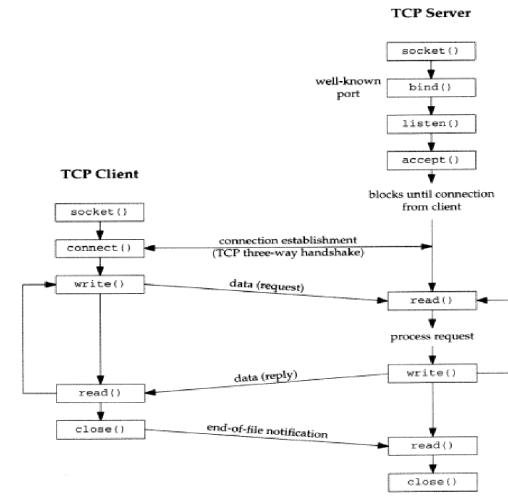

### Network layers 

application (Message or whatever ex: JSON)
UDP/TCP (byte stream)
IP (packets)

Each IP packets is a message with 3 components: 
* The sender's address.
* The receiver's address.
* The message data.

### Communication with packet-based scheme is not easy that is
why TCP/UDP is developed.

"UDP" is on the same layer as TCP, but is still packet-based like the lower layer.
UDP just adds port number over IP packets.

### The key difference: boundaries.
• UDP: Each read from a socket corresponds to a single write from the peer.
• TCP: No such correspondence! Data is a continuous flow of bytes.

### TCP simply has no mechanism for preserving boundaries.
1. TCP send buffer: This is where data is stored before transmission. Multiple writes
are indistinguishable from a single write.
2. Data is encapsulated as one or more IP packets, IP boundaries have no relationship to
the original write boundaries.
3. TCP receive buffer: Data is available to applications as it arrives.

The No. 1 beginner trap in socket programming is “concatenating & splitting TCP packets”
because there is no such thing as “TCP packets”. Protocols are required to interpret TCP
data by imposing boundaries within the byte stream.

### TCP End with 2 Handshakes

A peer tells the other side that no more data will be sent with the FIN flag, then the other
side ACKs the FIN. The remote application is notified of the termination when reading
from the channel.

Each direction of channels can be terminated independently, so the other side also performs
the same handshake to fully close the connection.

### Sockets

When you create a TCP connection, the connection is managed by your operating system,
and you use the socket handle to refer to the connection in the socket API

### Listening Socket & Connection Socket
A TCP server listens on a particular address (IP + port) and accepts client connections from
that address. The listening address is also represented by a socket handle. And when you
accept a new client connection, you get the socket handle of the TCP connection.
Now you know that there are 2 types of socket handles.

1. Listening sockets. Obtained by listening on an address.
2. Connection sockets. Obtained by accepting a client connection from a listening socket.

